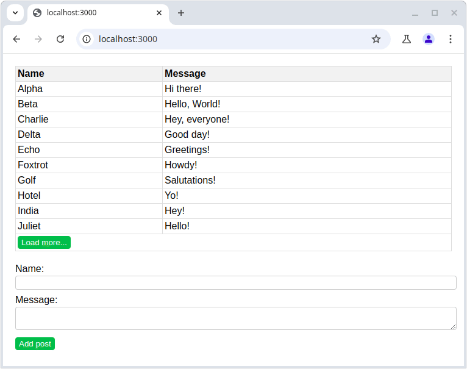

# Task 1

This exercise is about practicing setting up a full stack website powered by Express.

Your task is to create a simple website that includes a guest book. Visitors can leave their name and a message in the guest book. The guest book should display the messages that have been left by visitors. If there are more than 10 messages, display only the latest 10 and add a button to the bottom of the list to load more entries.

See below for a reference animation, but style the application however you like.

